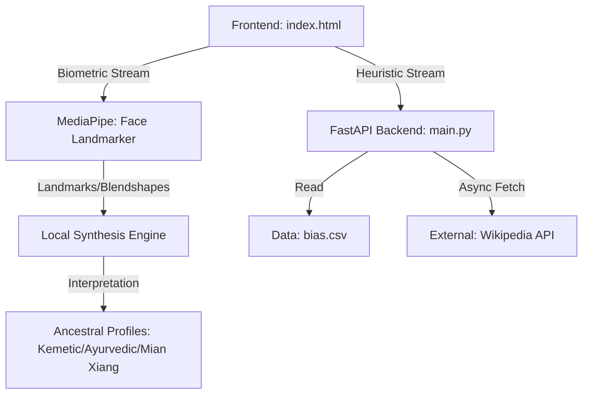

# ShieldNode | Sovereign Intelligence & Protection (v4.0)

## 1. Project Overview

**ShieldNode** is a comprehensive Community Intelligence & Protection Platform. Originally focused on cognitive bias detection, it has evolved into a multi-modal biometric and heuristic analysis node. It empowers users to recognize automated patterns in both discourse (via the Codex) and self-visage (via Ancestral Visage Analysis), promoting cognitive and spiritual sovereignty.

## 2. Design Philosophy & Rationale

- **Aesthetic**: "Bio-Digital HUD" — A synthesis of Afro-tech aesthetics, ancestral wisdom, and modern neural geometry.
- **Functionality**: Local-first biometric processing using MediaPipe. High-fidelity feedback loops provide immediate insight into internal states.
- **Ethical Implication**: By merging traditional face-reading wisdom with modern AI, we create a cultural mirror that reclaims biometric data for personal empowerment rather than state surveillance.

## 3. System Architecture & Data Flow

## 4. Component Analysis

### `main.py`

- **Purpose**: Heuristic analysis and Codex data provider.
- **Output**: JSON responses for text patterns and bias profiles.

### `index.html` (The Dashboard)

- **Purpose**: Single-page Command Center.
- **Modules**:
  - **Scanner**: Text heuristic analysis.
  - **Visage**: Real-time biometric ancestral mapping.
  - **Codex**: Intelligence DB of 80+ patterns.
  - **Node**: Identity and privacy management.

## 9. Action Plan & Next Steps

- [x] **Phase 4**: Integrated MediaPipe Ancestral Visage module.
- [ ] **Phase 5**: Real-time Emotional Bias detection during video calls.
- [ ] **Phase 6**: Integrate LLM (Claude/Gemini) for deep cultural synthesis of visage data.
- [ ] **Phase 7**: Decentralized P2P node syncing for community alerts (GunDB).
